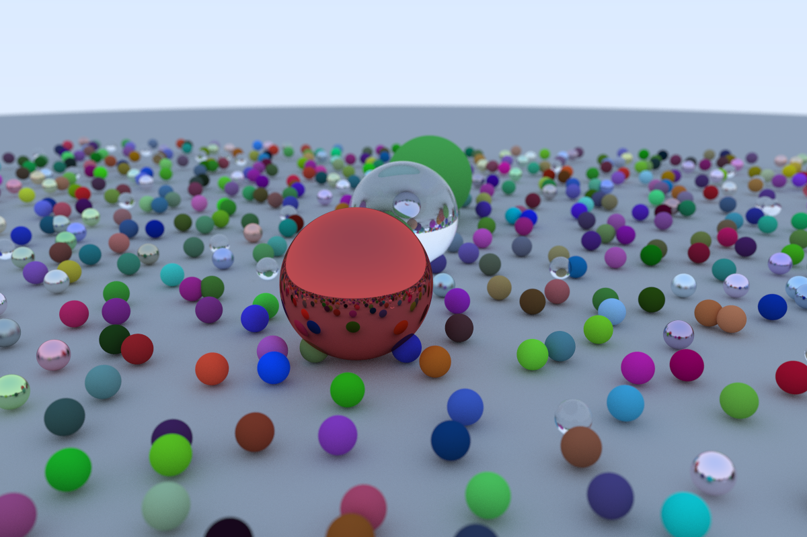

# Ray Tracing in Rust

Learning project guided by [Ray Tracing in One Weekend (in Rust)](https://misterdanb.github.io/raytracinginrust).


Example of a rendered scene generated with:

```
./ray_tracer --image-size 1200x800 --vertical-field-of-view 40 render.png
```

